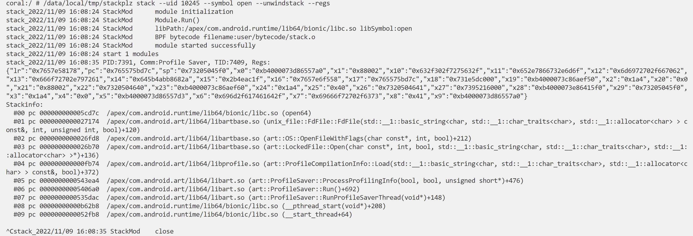
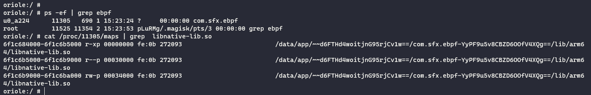
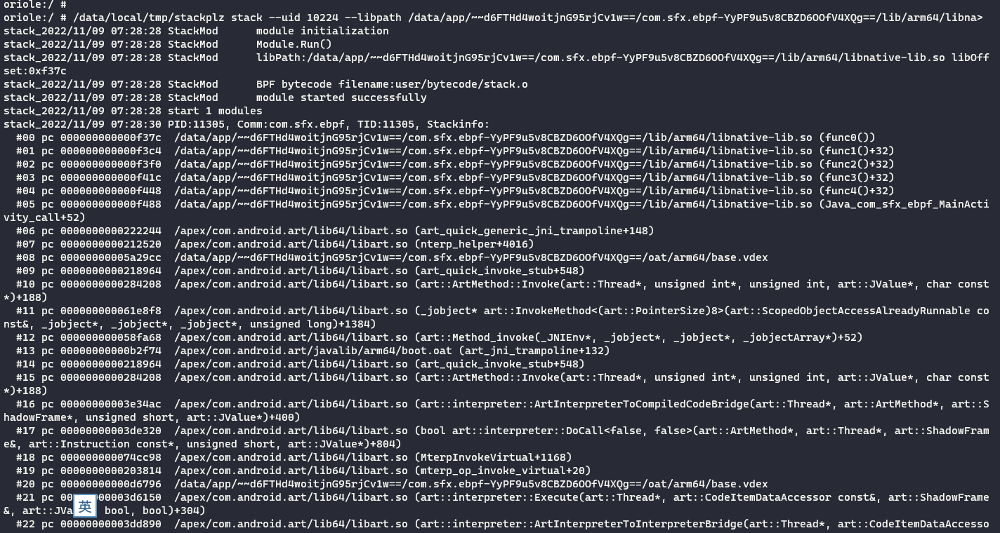
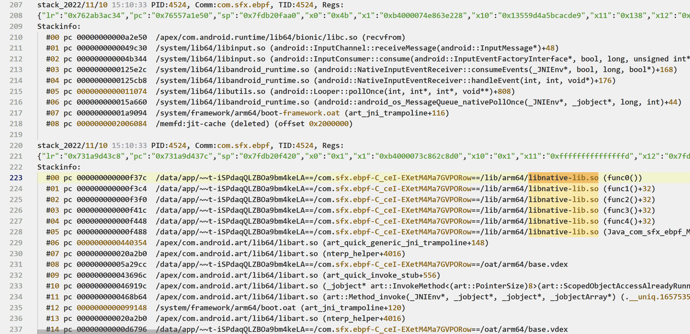
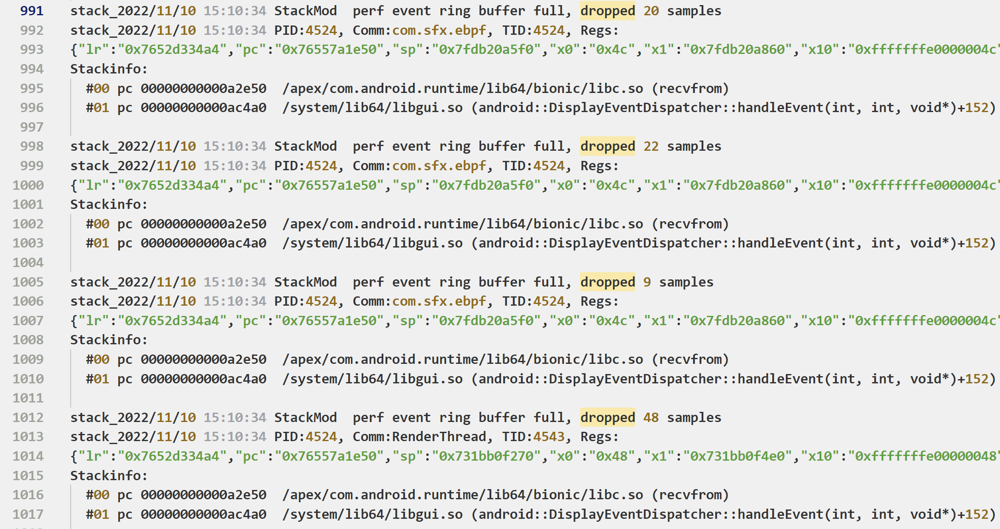

# stackplz

stackplz是一款基于eBPF的堆栈追踪工具，本项目主要参考以下项目和文章，致谢

- [eCapture(旁观者)](https://github.com/ehids/ecapture)
- [定制bcc/ebpf在android平台上实现基于dwarf的用户态栈回溯](https://bbs.pediy.com/thread-274546.htm)

特性：

- 对原进程影响极小
- 详细的堆栈信息

# 要求

- 手机有root权限
- 内核大于等于4.14，可使用`uname -r`查看自己手机的内核信息
- Android 11以及之后的系统版本
- 仅支持对64位库进行hook


# 使用

从release下载预编译好的二进制文件即可，或者自行编译，产物在`bin`目录下

1. 推送到手机的`/data/local/tmp`目录下，添加可执行权限即可

```bash
adb push stackplz /data/local/tmp
adb shell
su
chmod +x /data/local/tmp/stackplz
```

2. 第一次使用时需要释放库文件，请使用下面的命令

```bash
/data/local/tmp/stackplz stack --prepare
```


3. 参考下列命令示例进行hook

**必须指定目标进程的uid**，通过包名获取uid的命令如下

```bash
dumpsys package com.sfx.ebpf | grep userId=
```

**简单使用**：`--libpath`默认为`/apex/com.android.runtime/lib64/bionic/libc.so`，所以下面的命令是针对uid为10245的进程，hook对应libc.so的`open`函数，这里是通过uid过滤的，即使是多进程也不影响，另外还可以输出hook时的完整寄存器信息！

```bash
./stackplz stack --uid 10224 --symbol open --unwindstack --regs
```




**复杂使用**：指定偏移，对任意的APP三方库进行hook追踪，记得uid要对应

```bash
./stackplz stack --uid 10224 --libpath /data/app/~~d6FTHd4woitjnG95rjCv1w==/com.sfx.ebpf-YyPF9u5v8CBZD6OOfV4XQg==/lib/arm64/libnative-lib.so --offset 0xF37C --unwindstack
```

eBPF hook需要提供完整的库文件路径，所以我们需要先查看要hook的库具体是啥路径

最准确的做法是当程序运行时，查看程序的`/proc/{pid}/maps`内容，这里的路径是啥就是啥



路径看起来有些随机字符，但是APP安装后这个是不会变的，所以获取一次就行

效果如图：



查看更多帮助信息使用如下命令：

- `/data/local/tmp/stackplz -h`
- `/data/local/tmp/stackplz stack -h`

输出到日志文件添加`--log-file tmp.log`

只输出到日志，不输出到终端再加一个`--quiet`即可

# 批量hook

准备好`stackplz`和`config.json`，推送到手机

```bash
adb push stackplz /data/local/tmp
adb push config.json /data/local/tmp
```

参考下面的命令，目前可以仅使用`--regs`表示输出寄存器信息，但是现在还没有把批量hook的点和结果对应...所以请耐心等待完善

```bash
./stackplz stack -u 10245 --config config.json --unwindstack --regs --log-file tmp.log
```

效果如图：



有的时候可能丢失了部分信息，后续尝试完善，或者减少系统函数的hook点位



# 编译

本项目依赖于[ehids/ebpfmanager](https://github.com/ehids/ebpfmanager)和[cilium/ebpf](https://github.com/cilium/ebpf)，但是做出了一些修改

所以目前编译需要使用我修改过的版本，三个项目需要放在同一目录下

```bash
git clone https://github.com/SeeFlowerX/ebpf
git clone https://github.com/SeeFlowerX/ebpfmanager
```

然后是本项目的代码

```bash
git clone https://github.com/SeeFlowerX/stackplz
```

本项目在linux x86_64环境下编译，编译时先进入本项目根目录

准备必要的外部代码，记得挂全局代理或者使用`proxychains`等工具

```bash
./build_env.sh
```

然后下载ndk并解压，我这里选的是`android-ndk-r25b`，解压后修改`build.sh`中的`NDK_ROOT`路径

本项目还需要使用golang，版本要求为`1.18`，建议通过snap安装，**或者**使用如下方法安装

```bash
wget "https://golang.org/dl/go1.18.7.linux-amd64.tar.gz"
tar -C /usr/local -xvf "go1.18.7.linux-amd64.tar.gz"
```

设置环境变量

```bash
nano ~/.bashrc
```

在末尾添加如下内容

```bash
export GOPATH=$HOME/go
export PATH=/usr/local/go/bin:$PATH:$GOPATH/bin
export GOPROXY=https://goproxy.cn,direct
export GO111MODULE=on
```

对单个项目来说，似乎要用下面的命令手动操作下，再重新用vscode打开才不会报错

```bash
go env -w GO111MODULE=on
go env -w GOPROXY=https://goproxy.cn,direct
```

使环境变量立即生效

```bash
source ~/.bashrc
```

执行`./build.sh`即可完成编译，产物在`bin`目录下

将可执行文件推送到手机上后就可以开始使用了

```bash
adb push bin/stackplz /data/local/tmp
```

# TODO

- 通过配置文件实现批量hook
- 优化代码逻辑...

# Q & A

1. 使用时手机卡住并重启怎么办？

经过分析，出现这种情况是因为`bpf_perf_event_output`参数三使用的是`BPF_F_CURRENT_CPU`导致

借助[vmlinux-to-elf](https://github.com/marin-m/vmlinux-to-elf)把boot.img转换成ELF文件，通过对比分析

发现出现崩溃的内核走到了`brk 1`指令，但是这个分支本不该存在，详细分析过程后续会单独出一篇文章


对于此种情况，建议升级系统到Android 12版本一般可以避免

~~(或者尝试自己编译下内核？)~~

2. `preload_libs`里面的库怎么编译的？

参见：[unwinddaemon](https://github.com/SeeFlowerX/unwinddaemon)

3. perf event ring buffer full, dropped 9 samples

待完善，wating plz...

3. 仅使用`--regs`不知道对应哪个hook点

待完善，wating plz...

# 交流

安卓逆向、eBPF技术、反调对抗、搞机...欢迎加入讨论


后续将就本项目从0到1的过程分享系列文章，欢迎关注