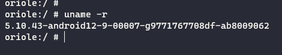
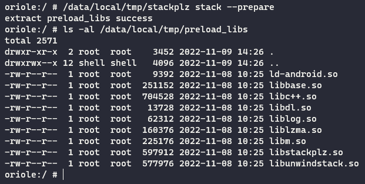
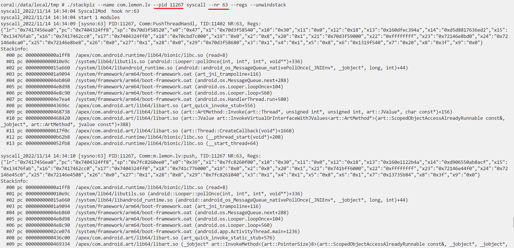
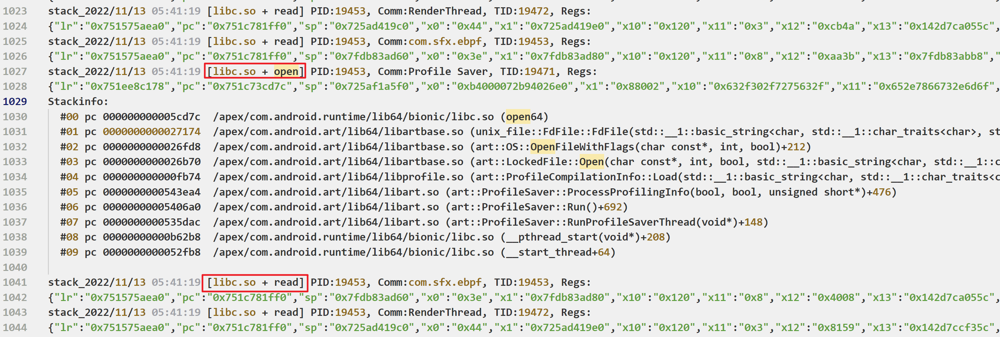
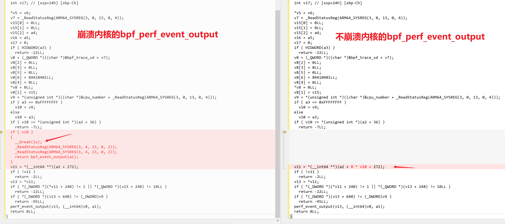

# stackplz

stackplz是一款基于eBPF的堆栈追踪工具，本项目主要参考以下项目和文章，致谢

- [eCapture(旁观者)](https://github.com/ehids/ecapture)
- [定制bcc/ebpf在android平台上实现基于dwarf的用户态栈回溯](https://bbs.pediy.com/thread-274546.htm)

特性：

- 对原进程影响极小
- 详细的堆栈信息

# 要求

- 手机有root权限
- 内核大于等于4.14，可使用`uname -r`查看自己手机的内核信息
- Android 11以及之后的系统版本
- 仅支持对64位库进行hook



# 使用

从release下载预编译好的二进制文件即可，或者自行编译，产物在`bin`目录下

1. 推送到手机的`/data/local/tmp`目录下，添加可执行权限即可

```bash
adb push stackplz /data/local/tmp
adb shell
su
chmod +x /data/local/tmp/stackplz
```

2. 第一次使用时需要释放库文件，请使用下面的命令

```bash
/data/local/tmp/stackplz stack --prepare
```



3. 参考下列命令示例进行hook

追踪系统调用时的堆栈，以及寄存器信息，支持按pid过滤

```bash
./stackplz --name com.lemon.lv --pid 11267 syscall --nr 63 --regs --unwindstack
```



通过**指定uid**，对`/apex/com.android.runtime/lib64/bionic/libc.so`的`open`函数进行hook

```bash
./stackplz --uid 10245 stack --symbol open --unwindstack --regs
```


通过**指定包名**，对`libnative-lib.so`的`_Z5func1v`符号进行hook

```bash
./stackplz --name com.sfx.ebpf stack --library libnative-lib.so --symbol _Z5func1v --unwindstack --regs
```


通过**指定包名和配置文件**进行批量hook

```bash
./stackplz --name com.sfx.ebpf stack --config config.json
```



配置文件示例如下

```json
{
    "library_dirs": [
        "/apex/com.android.runtime/lib64"
    ],
    "libs": [
        {
            "library": "bionic/libc.so",
            "disable": false,
            "configs": [
                {
                    "unwindstack": true,
                    "regs": true,
                    "symbols": ["open"],
                    "offsets": []
                },
                {
                    "unwindstack": false,
                    "regs": true,
                    "symbols": ["read", "send", "recv"],
                    "offsets": []
                }
            ]
        },
        {
            "library": "libnative-lib.so",
            "disable": false,
            "configs": [
                {
                    "unwindstack": true,
                    "regs": true,
                    "symbols": ["_Z5func1v"],
                    "offsets": ["0xF37C"]
                }
            ]
        }
    ]
}
```

字段说明：

- `library_dirs` 目标库的搜索路径，可以设置多个
- `libs` 目标多个库的hook配置
    - `library` 库名、完整库路径或者与搜索路径拼接后存在的路径
    - `disable` 是否启用hook
    - `configs` 目标库的多个hook点配置，按输出需要进行配置
        - 即输出堆栈与输出寄存器信息的组合，每一种组合都可以设定多个符号和多个偏移

注意事项：

- 必须提供包名或者目标的uid，二选一
- 默认hook的库是`/apex/com.android.runtime/lib64/bionic/libc.so`，可以只提供符号进行hook
- hook目标加载的库时，默认在对应的库目录搜索，所以可以直接指定库名而不需要完整路径
    - 例如 `/data/app/~~t-iSPdaqQLZBOa9bm4keLA==/com.sfx.ebpf-C_ceI-EXetM4Ma7GVPORow==/lib/arm64`
- 如果要hook的库无法被自动检索到，请提供在内存中加载的完整路径
    - 最准确的做法是当程序运行时，查看程序的`/proc/{pid}/maps`内容，这里的路径是啥就是啥
- 批量hook请记得把配置文件推送到程序运行的同一目录

查看更多帮助信息使用如下命令：

- `/data/local/tmp/stackplz -h`
- `/data/local/tmp/stackplz stack -h`

输出到日志文件添加`-o/--out tmp.log`，只输出到日志，不输出到终端再加一个`--quiet`即可

# 编译

本项目依赖于[ehids/ebpfmanager](https://github.com/ehids/ebpfmanager)和[cilium/ebpf](https://github.com/cilium/ebpf)，但是做出了一些修改

所以目前编译需要使用我修改过的版本，三个项目需要放在同一目录下

```bash
git clone https://github.com/SeeFlowerX/ebpf
git clone https://github.com/SeeFlowerX/ebpfmanager
```

然后是本项目的代码

```bash
git clone https://github.com/SeeFlowerX/stackplz
```

本项目在linux x86_64环境下编译，编译时先进入本项目根目录

准备必要的外部代码，记得挂全局代理或者使用`proxychains`等工具

```bash
./build_env.sh
```

然后下载ndk并解压，我这里选的是`android-ndk-r25b`，解压后修改`build.sh`中的`NDK_ROOT`路径

本项目还需要使用golang，版本要求为`1.18`，建议通过snap安装，**或者**使用如下方法安装

```bash
wget "https://golang.org/dl/go1.18.7.linux-amd64.tar.gz"
tar -C /usr/local -xvf "go1.18.7.linux-amd64.tar.gz"
```

设置环境变量

```bash
nano ~/.bashrc
```

在末尾添加如下内容

```bash
export GOPATH=$HOME/go
export PATH=/usr/local/go/bin:$PATH:$GOPATH/bin
export GOPROXY=https://goproxy.cn,direct
export GO111MODULE=on
```

对单个项目来说，似乎要用下面的命令手动操作下，再重新用vscode打开才不会报错

```bash
go env -w GO111MODULE=on
go env -w GOPROXY=https://goproxy.cn,direct
```

使环境变量立即生效

```bash
source ~/.bashrc
```

执行`./build.sh`即可完成编译，产物在`bin`目录下

将可执行文件推送到手机上后就可以开始使用了

```bash
adb push bin/stackplz /data/local/tmp
```

# TODO

- 从0到1文章
- 优化代码逻辑...

# Q & A

1. 使用时手机卡住并重启怎么办？

经过分析，出现这种情况是因为`bpf_perf_event_output`参数三使用的是`BPF_F_CURRENT_CPU`导致

借助[vmlinux-to-elf](https://github.com/marin-m/vmlinux-to-elf)把boot.img转换成ELF文件，通过对比分析

发现出现崩溃的内核走到了`brk 1`指令，但是这个分支本不该存在，详细分析过程后续会单独出一篇文章



对于此种情况，建议升级系统到Android 12版本一般可以避免

~~(或者尝试自己编译下内核？)~~

2. `preload_libs`里面的库怎么编译的？

参见：[unwinddaemon](https://github.com/SeeFlowerX/unwinddaemon)

3. perf event ring buffer full, dropped 9 samples

有待优化，目前建议是不输出堆栈，或者减少hook点

4. 通过符号hook确定调用了但是不输出信息？

某些符号存在多种实现（或者重定位？），这个时候需要指定具体使用的符号或者偏移

例如`strchr`可能实际使用的是`__strchr_aarch64`，这个时候应该指定`__strchr_aarch64`而不是`strchr`

```bash
coral:/data/local/tmp # readelf -s /apex/com.android.runtime/lib64/bionic/libc.so | grep strchr
   868: 00000000000b9f00    32 GNU_IFUNC GLOBAL DEFAULT   14 strchrnul
   869: 00000000000b9ee0    32 GNU_IFUNC GLOBAL DEFAULT   14 strchr
  1349: 000000000007bcf8    68 FUNC    GLOBAL DEFAULT   14 __strchr_chk
   689: 000000000004a8c0   132 FUNC    LOCAL  HIDDEN    14 __strchrnul_aarch64_mte
   692: 000000000004a980   172 FUNC    LOCAL  HIDDEN    14 __strchrnul_aarch64
   695: 000000000004aa40   160 FUNC    LOCAL  HIDDEN    14 __strchr_aarch64_mte
   698: 000000000004ab00   204 FUNC    LOCAL  HIDDEN    14 __strchr_aarch64
  5143: 00000000000b9ee0    32 FUNC    LOCAL  HIDDEN    14 strchr_resolver
  5144: 00000000000b9f00    32 FUNC    LOCAL  HIDDEN    14 strchrnul_resolver
  5550: 00000000000b9ee0    32 GNU_IFUNC GLOBAL DEFAULT   14 strchr
  6253: 000000000007bcf8    68 FUNC    GLOBAL DEFAULT   14 __strchr_chk
  6853: 00000000000b9f00    32 GNU_IFUNC GLOBAL DEFAULT   14 strchrnul
```

如图，我们可以看到直接调用了`__strchr_aarch64`而不是经过`strchr`再去调用`__strchr_aarch64`


# 交流

安卓逆向、eBPF技术、反调对抗、搞机...欢迎加入讨论


后续将就本项目从0到1的过程分享系列文章，欢迎关注