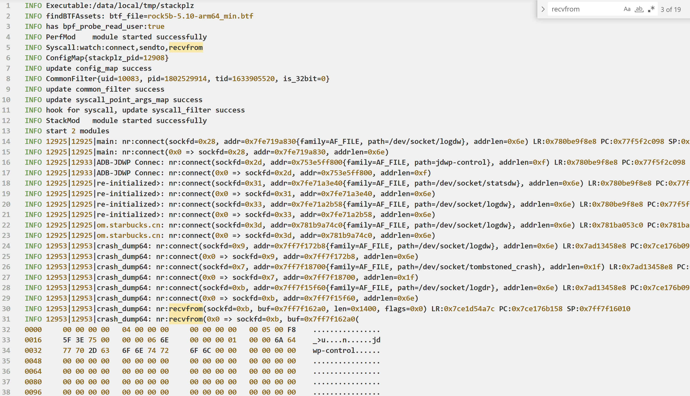
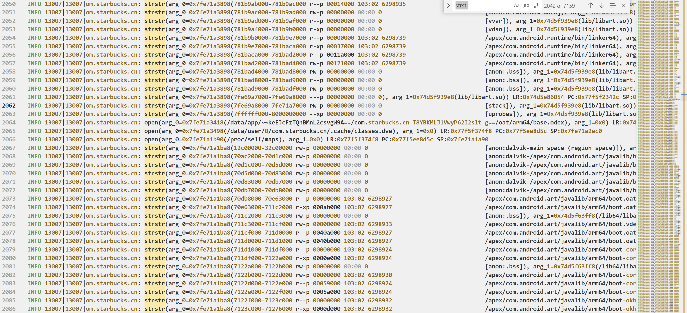
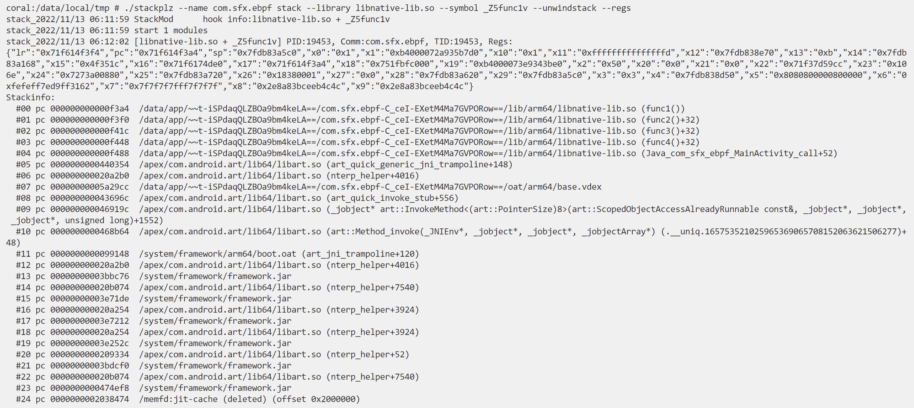
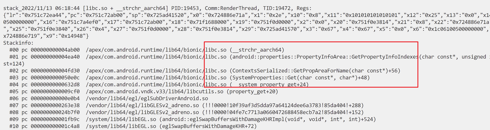

# stackplz

stackplz是一款基于eBPF的堆栈追踪工具，仅适用于Android平台（开发板+Docker也支持）

特性：

- 支持arm64 syscall trace，可以打印参数、调用栈、寄存器
    - 参数结果包括详细的结构体信息，类似于strace
- 支持对64位用户态动态库进行uprobe hook，可以打印参数、调用栈、寄存器
- 支持硬件断点功能，可以打印调用栈、寄存器
- 支持按线程名黑名单、白名单过滤
- 支持pid和tid的黑名单、白名单过滤
- 支持追踪fork产生的进程

要求：

- root权限，系统内核版本5.10+（可在设置中查看或执行`uname -r`查看）

# 使用

从Releases或者Github Action下载最新预编译好的二进制文件即可

1. 推送到手机的`/data/local/tmp`目录下，添加可执行权限即可

```bash
adb push stackplz /data/local/tmp
adb shell
su
chmod +x /data/local/tmp/stackplz
```

2. 每次使用新版本时需要释放库文件，请使用下面的命令

```bash
cd /data/local/tmp && ./stackplz --prepare
```

3. 命令示意

3.1 **追踪syscall**

```bash
./stackplz -n com.starbucks.cn --syscall connect,sendto,recvfrom -o tmp.log --dumphex
```



3.2 **追踪libc的open**

注：默认设定的库是`/apex/com.android.runtime/lib64/bionic/libc.so`，要自定义请使用`--lib`指定

```bash
./stackplz -n com.starbucks.cn --point strstr[str,str] --point open[str,int] -o tmp.log
```



3.3 通过**指定包名**，对`libnative-lib.so`的`_Z5func1v`符号进行hook

```bash
./stackplz --name com.sfx.ebpf --lib libnative-lib.so --point _Z5func1v --stack
```



3.4 在命中uprobe hook时发送信号

有时候希望在经过特定点位的时候停止进程，以便于dump内存，那么可以使用`--kill`来发送信号，示例：

```bash
./stackplz -n com.sfx.ebpf --lib libnative-lib.so -w _Z5func1v --stack --kill SIGSTOP
./stackplz -n com.starbucks.cn --syscall exit --kill SIGSTOP --stack
```

如果要恢复进程运行，可以用下面这样的命令（另起一个shell，root下执行）：

```bash
kill -SIGCONT 4326
```

3.5 **硬件断点**示例如下，支持的断点类型：`r,w,rw,x`

pid + 绝对地址

```bash
./stackplz -p 9613 --brk 0x70ddfd63f0:x --stack
```

pid + 偏移 + 库文件

```bash
./stackplz -p 3102 --brk 0xf3a4:x --brk-lib libnative-lib.so --stack
```

3.6 以寄存器的值作为大小读取数据、或者指定大小

```bash
./stackplz --name com.sfx.ebpf -w write[int,buf:x2,int]
./stackplz --name com.sfx.ebpf -w write[int,buf:32,int]
./stackplz --name com.sfx.ebpf -w write[int,buf:0x10,int]
```

使用提示：

- 可以用`--name`指定包名，用`--uid`指定进程所属uid，用`--pid`指定进程
- 默认hook的库是`/apex/com.android.runtime/lib64/bionic/libc.so`，可以只提供符号进行hook
- hook目标加载的库时，默认在对应的库目录搜索，所以可以直接指定库名而不需要完整路径
    - 例如 `/data/app/~~t-iSPdaqQLZBOa9bm4keLA==/com.sfx.ebpf-C_ceI-EXetM4Ma7GVPORow==/lib/arm64`
- 如果要hook的库无法被自动检索到，请提供在内存中加载的完整路径
    - 最准确的做法是当程序运行时，查看程序的`/proc/{pid}/maps`内容，这里的路径是啥就是啥
- hook动态库请使用`--point/-w`，可设置多个，语法是{符号/基址偏移}{+符号偏移}{[参数类型,参数类型...]}
    - --point _Z5func1v
    - --point strstr[str,str] --point open[str,int]
    - --point write[int,buf:64]
    - --point 0x9542c[str,str]
    - --point strstr+0x4[str,str]
- hook syscall需要指定`--syscall/-s`选项，多个syscall请使用`,`隔开
    - --syscall openat
- 特别的，指定为`all`表示追踪全部syscall
    - --syscall all
- **特别说明**，很多结果是`0xffffff9c`这样的结果，其实是`int`，但是目前没有专门转换
- 注意，本项目中syscall的返回值通常是**errno**，与libc的函数返回结果不一定一致
- `--dumphex`表示将数据打印为hexdump，否则将记录为`ascii + hex`的形式
- 输出到日志文件添加`-o/--out tmp.log`，只输出到日志，不输出到终端再加一个`--quiet`即可

更多用法，请通过`-h/--help`查看：

- `/data/local/tmp/stackplz -h`

# 编译

可参考[workflow](.github/workflows/build.yml)或下面的步骤：

本项目依赖于[ehids/ebpfmanager](https://github.com/ehids/ebpfmanager)和[cilium/ebpf](https://github.com/cilium/ebpf)，但是做出了一些修改

所以目前编译需要使用修改过的版本，三个项目需要放在同一目录下

```bash
git clone https://github.com/SeeFlowerX/ebpf
git clone https://github.com/SeeFlowerX/ebpfmanager
git clone https://github.com/SeeFlowerX/stackplz
```

本项目在linux x86_64环境下编译，编译时先进入本项目根目录

准备必要的外部代码，记得挂全局代理或者使用`proxychains`等工具

```bash
./build_env.sh
```

然后下载ndk并解压，这里选的是`android-ndk-r25b`，解压后修改`build.sh`中的`NDK_ROOT`路径

本项目还需要使用golang，版本要求为`1.18`，建议通过snap安装，**或者**使用如下方法安装

```bash
wget "https://golang.org/dl/go1.18.7.linux-amd64.tar.gz"
tar -C /usr/local -xvf "go1.18.7.linux-amd64.tar.gz"
```

设置环境变量

```bash
nano ~/.bashrc
```

在末尾添加如下内容

```bash
export GOPATH=$HOME/go
export PATH=/usr/local/go/bin:$PATH:$GOPATH/bin
export GOPROXY=https://goproxy.cn,direct
export GO111MODULE=on
```

对单个项目来说，似乎要用下面的命令手动操作下，再重新用vscode打开才不会报错

```bash
go env -w GO111MODULE=on
go env -w GOPROXY=https://goproxy.cn,direct
```

使环境变量立即生效

```bash
source ~/.bashrc
```

执行`./build.sh`即可完成编译，产物在`bin`目录下

将可执行文件推送到手机上后就可以开始使用了

```bash
adb push bin/stackplz /data/local/tmp
```

# Q & A

1. `preload_libs`里面的库怎么编译的？

参见：[unwinddaemon](https://github.com/SeeFlowerX/unwinddaemon)

2. perf event ring buffer full, dropped 9 samples

使用`-b/-buffer`设置每个CPU的缓冲区大小，默认为`8M`，如果出现数据丢失的情况，请适当增加这个值，直到不再出现数据丢失的情况

命令示意如下：

```bash
./stackplz -n com.starbucks.cn -b 32 --syscall all -o tmp.log
```

一味增大缓冲区大小也可能带来新的问题，比如分配失败，这个时候建议尽可能清理正在运行的进程

> failed to create perf ring for CPU 0: can't mmap: cannot allocate memory

3. 通过符号hook确定调用了但是不输出信息？

某些符号存在多种实现（或者重定位？），这个时候需要指定具体使用的符号或者偏移

例如`strchr`可能实际使用的是`__strchr_aarch64`，这个时候应该指定`__strchr_aarch64`而不是`strchr`

```bash
coral:/data/local/tmp # readelf -s /apex/com.android.runtime/lib64/bionic/libc.so | grep strchr
   868: 00000000000b9f00    32 GNU_IFUNC GLOBAL DEFAULT   14 strchrnul
   869: 00000000000b9ee0    32 GNU_IFUNC GLOBAL DEFAULT   14 strchr
  1349: 000000000007bcf8    68 FUNC    GLOBAL DEFAULT   14 __strchr_chk
   689: 000000000004a8c0   132 FUNC    LOCAL  HIDDEN    14 __strchrnul_aarch64_mte
   692: 000000000004a980   172 FUNC    LOCAL  HIDDEN    14 __strchrnul_aarch64
   695: 000000000004aa40   160 FUNC    LOCAL  HIDDEN    14 __strchr_aarch64_mte
   698: 000000000004ab00   204 FUNC    LOCAL  HIDDEN    14 __strchr_aarch64
  5143: 00000000000b9ee0    32 FUNC    LOCAL  HIDDEN    14 strchr_resolver
  5144: 00000000000b9f00    32 FUNC    LOCAL  HIDDEN    14 strchrnul_resolver
  5550: 00000000000b9ee0    32 GNU_IFUNC GLOBAL DEFAULT   14 strchr
  6253: 000000000007bcf8    68 FUNC    GLOBAL DEFAULT   14 __strchr_chk
  6853: 00000000000b9f00    32 GNU_IFUNC GLOBAL DEFAULT   14 strchrnul
```

如图，可以看到直接调用了`__strchr_aarch64`而不是经过`strchr`再去调用`__strchr_aarch64`



# 交流

有关eBPF on Android系列可以加群交流


个人碎碎念太多，有关stackplz文章就不同步到本项目了，请移步博客查看：

- [eBPF on Android之stackplz从0到1](https://blog.seeflower.dev/archives/176/)
- [eBPF on Android之stackplz从0到1（补充）手机为何重启](https://blog.seeflower.dev/archives/177/)

之前针对syscall追踪并获取参数单独开了一个项目，整体结构更简单，没有interface，有兴趣请移步[estrace](https://github.com/SeeFlowerX/estrace)

不过目前`estrace`的全部功能已经在stackplz中实现，不日将存档

# Ref

本项目参考了以下项目和文章：

- [eCapture(旁观者)](https://github.com/ehids/ecapture)
- [定制bcc/ebpf在android平台上实现基于dwarf的用户态栈回溯](https://bbs.pediy.com/thread-274546.htm)
- [Simpleperf](https://android.googlesource.com/platform/system/extras/+/master/simpleperf/doc/README.md)
- [Tracee](https://github.com/aquasecurity/tracee)
- [bpftrace](https://github.com/iovisor/bpftrace)