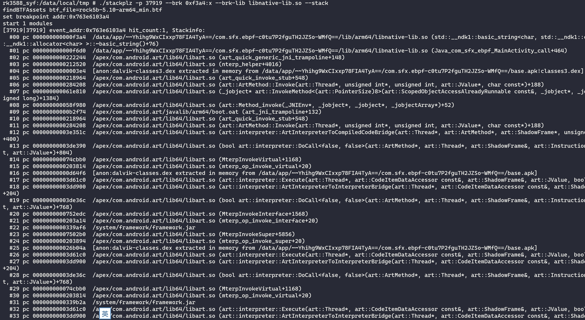

# stackplz

stackplz是一款基于eBPF的堆栈追踪工具，目前仅适用于Android平台

特性：

- 支持arm64 syscall trace，可以打印参数(包括详细的结构体信息)、调用栈、寄存器
- 支持对64位用户态动态库进行uprobe hook，可以打印参数、调用栈、寄存器
- 支持硬件断点功能，可以打印调用栈、寄存器，并且提供了frida rpc调用
- 支持进程号、线程号、线程名的黑白名单过滤
- 支持追踪fork产生的进程

要求：

- root权限，系统内核版本5.10+（可执行`uname -r`查看）
- 对于4.1x的内核，内核开启了CONFIG_HAVE_HW_BREAKPOINT，硬件断点功能同样可以使用

不仅仅是真机，这些环境下也可以使用：

- arm开发板刷安卓镜像
- arm开发板/云服务器 + Docker + ReDroid
- Apple M系列设备 + 安卓官方arm64模拟器
- 有root权限，内核版本5.10+的云真机也可以

# 使用

从Releases或者Github Action下载最新预编译好的二进制文件即可

1. 推送到手机的`/data/local/tmp`目录下，添加可执行权限即可

```bash
adb push stackplz /data/local/tmp
adb shell
su
chmod +x /data/local/tmp/stackplz
```

注意：**v3.0.1**之前，使用不同版本时，需要释放库文件，请使用下面的命令

```bash
cd /data/local/tmp && ./stackplz --prepare
```

## 2. 选项说明

stackplz的所有可用选项，可以通过`./stackplz --help`查看

2.1 **用于对目标进程/线程进行过滤的选项**

注意：如果存在多个目标，使用逗号隔开；`--no-xxx`意为黑名单

| 选项 | 黑名单选项 | 说明 |
| :- | :- | :- |
| -n/--name|  | APP包名，分组名(root/system/shell/app/iso) |
| -u/--uid | --no-uid | 目标uid |
| -p/--pid | --no-pid | 目标pid |
| -t/--tid | --no-tid | 目标tid |
| --tname | --no-tname | 目标线程名，注意最多16字节 |

2.2 **syscall/uprobe hook选项**

- -s/--syscall name/group

即syscall hook，后跟系统调用号对应的名字，或者分组，对应的黑名单选项`--no-syscall`

- -w/--point symbol/offset[type,type,...]

即uprobe hook，必须配合`-l/--lib`使用，具体用法参考后面的命令演示

2.3 **硬件断点相关选项**

| 选项 | 默认值 | 说明 |
| :- | :-: | :- |
| --brk | | 要下断的地址 |
| --brk-len | 4 | 断点长度 |
| --brk-lib | | 目标库，使用该选项时--brk为相对偏移 |
| --brk-pid | -1 | 目标进程pid，通常不建议设置该选项 |

2.4 **发送信号选项**

即`--kill SIGSTOP/SIGABRT/SIGTRAP/...`，只能设置一个，效果是在命中hook时向目标进程发送信号

2.5 **参数过滤选项**

即`-f/--filter`，该选项用于设定参数的过滤规则

| 规则 | 示例 | 说明 |
| :- | :- | :- |
| w/white | w:/sbin/su | 字符串白名单，过滤以`/sbin/su`开头的内容，最多256字节 |
| b/black | b:/sbin/su | 字符串黑名单，过滤以`/sbin/su`开头的内容，最多256字节 |
| bx/bufhex | bx:73ea68 | buffer数据白名单，过滤16进制以`73ea68`开头的内容，最多比较8字节 |
| eq/equal | eq:0x748a484d2c | 寄存器值白名单，过滤寄存器值等于`0x748a484d2c`的内容 |

2.6 **部分布尔类型选项**

| 选项 | 说明 |
| :- | :- |
| --auto | 该选项需要配合--kill SIGSTOP使用，效果是自动恢复被挂起的进程 |
| --btf | 显式声明当前环境的内核开启了CONFIG_DEBUG_INFO_BTF |
| --color | 该选项需要配合--dumphex使用，效果是在终端显示颜色 |
| --dumphex | 启用该选项后，对于buf类型数据将输出为hexdump，风格与CyberChef保持一致 |
| --getoff | 输出PC和LR的偏移信息，注意使用该选项会导致性能降低 |
| --json | 将日志输出为json格式 |
| --mstack | 简易实现堆栈回溯，没有符号信息 |
| --nocheck | 禁用bpf特性检查，没有`/proc/config.gz`或者是其他路径时使用 |
| --quiet | 不在终端输出日志 |
| --regs | 输出全部寄存器 |
| --showpc | 输出堆栈原始PC值 |
| --showtime | 输出自开机以来的时间，单位ns |
| --showuid | 输出记录的uid |
| --stack | 输出堆栈 |

2.7 **rpc选项**

主要用于frida联动，远程下硬件断点

- server 监听命令 ./stackplz --rpc --stack
- client frida脚本参考 [frida_hw_brk.js](./frida_hw_brk.js)
- 端口可以通过`--rpc-path`修改，默认`127.0.0.1:41718`
- 用其他方式发socket联动也可以，自行实现

2.8 **杂项选项**

- `-a/--arch` 目标进程架构，默认aarch64，计划为aarch32 syscall trace提供支持
- `-b/--buffer` perf缓冲区大小，默认8，即8M
    - 增大该数值可以减少数据丢失，如果太大会出现了失败的错误，请停止重新设置一个数值，通常建议不超过32M
- `-c/--config` 配置文件模式
    - 配置文件具体使用方式请查看[配置文件文档](./docs/CONFIG.md)
- `--full-tname` 默认对于一些高频调用syscall的系统线程进行了屏蔽，启用该选项后将解除屏蔽
- `-l/--lib` 动态库名或者动态库完整路径，配合`-w/--point`选项使用
- `-o/--out` 日志文件名，默认`stackplz_tmp.log`
- `--dump` 即dump模式，hook获取到的数据不会被解析，仅保存到单个文件
- `--parse` 即针对dump得到的文件进行解析，可能比较耗时，可能存在bug
- `--stack-size` 堆栈大小，默认8192字节，基本够用，最大65528

## 3. 命令演示

3.1 **追踪syscall**

```bash
./stackplz -n com.starbucks.cn --syscall connect,sendto,recvfrom -o tmp.log --dumphex
```


> 自定义syscall参数类型

受限于代码结构，暂时采取了一种迂回的方法

即，在uprobe的写法下，末尾加上`s/ss`，即可转为hook syscall，两个s表示syscall退出时也同样读取结构体的详细数据

常规类型末尾的x表示输出为hex

```bash
./stackplz -n com.termux -w writev[int,ptr,intx]s
./stackplz -n com.termux -w writev[ptrx,buf,ptrx]ss --dumphex --color
```

关于syscall名，请查阅[Linux kernel syscall tables](https://syscalls.mebeim.net/?table=arm64/64/aarch64/v6.2)

3.2 **追踪libc的open**

注：默认设定的库是`/apex/com.android.runtime/lib64/bionic/libc.so`，要自定义请使用`--lib`指定

```bash
./stackplz -n com.starbucks.cn --point strstr[str,str] --point open[str,int] -o tmp.log
```


3.3 通过**指定包名**，对`libnative-lib.so`的`_Z5func1v`符号处下执行断点，并打印堆栈

```bash
./stackplz --brk-pid `pidof com.sfx.ebpf` --brk 0xf3a4:x --brk-lib libnative-lib.so --stack
```



3.4 在命中uprobe hook时发送信号

有时候希望在经过特定点位的时候停止进程，以便于dump内存，那么可以使用`--kill`来发送信号，示例：

```bash
./stackplz -n com.sfx.ebpf --lib libnative-lib.so -w _Z5func1v --stack --kill SIGSTOP
./stackplz -n com.starbucks.cn --syscall exit --kill SIGSTOP --stack
```

如果要恢复进程运行，可以用下面这样的命令（另起一个shell，root下执行）：

```bash
kill -SIGCONT 4326
```

v3.0.0版本起，可以在终端输入c后回车恢复进程运行

3.5 **硬件断点**示例如下，支持的断点类型：`r,w,rw,x`

pid + 绝对地址

```bash
./stackplz --brk-pid `pidof com.sfx.ebpf` --brk 0x70ddfd63f0:x --stack
```

pid + 偏移 + 库文件

```bash
./stackplz --brk-pid `pidof com.sfx.ebpf` --brk 0xf3a4:x --brk-lib libnative-lib.so --stack
```

对内核中的函数下硬件断点：

**！！！注意，内核函数通常触发非常频繁，该操作可能导致设备重启，请谨慎使用，原因不明**

```bash
echo 1 > /proc/sys/kernel/kptr_restrict
cat /proc/kallsyms  | grep "T sys_"
./stackplz --brk 0xffffff93c5beb634:x --brk-pid `pidof com.sfx.ebpf` --stack
./stackplz --brk 0xffffffc0003654dc:x --brk-pid `pidof com.sfx.ebpf` --regs
```

某些时候确信数据被访问了，但是上面的命令还是没有输出，请尝试省略`--brk-pid`选项，即使用默认值`-1`

3.6 以寄存器的值作为大小读取数据、或者指定大小

```bash
./stackplz --name com.sfx.ebpf -w write[int,buf:x2,int]
./stackplz --name com.sfx.ebpf -w write[int,buf:32,int]
./stackplz --name com.sfx.ebpf -w write[int,buf:0x10,int]
```

进阶用法：

在`libc.so+0xA94E8`处下断，读取`x1`为`int`，读取`sp+0x30-0x2c`为`ptr`

```bash
./stackplz --name com.sfx.ebpf -w 0xA94E8[int:x1,ptr:sp+0x30-0x2c]
```

在`libc.so+0xA94E8`处下断，读取`x1`为`int`，读取`sp+0x30-0x2c`为`buf`，长度为`8`

```bash
./stackplz --name com.sfx.ebpf -w 0xA94E8[int:x1,buf:8:sp+0x30-0x2c]
```

```bash
.text:00000000000A94E4                 LDR             W1, [SP,#0x30+var_2C]
.text:00000000000A94E8                 MOV             W20, W0
```

按默认顺序读取，以及按指定寄存器读取，下面的示例中两个方式输出结果相反：

```bash
./stackplz --name com.sfx.ebpf -w 0xA94E8[int,int]
./stackplz --name com.sfx.ebpf -w 0xA94E8[int:x1,int:x0]
```

在`call_constructors`处获取`soinfo`内容

```bash
# 打印名称和完整路径
./stackplz -n com.coolapk.market -l linker64 -w __dl__ZN6soinfo17call_constructorsEv[ptr,str.f0:x0+409,str:x0+448.] -f w:libjiagu
./stackplz -n com.coolapk.market -l linker64 -w __dl__ZN6soinfo17call_constructorsEv[ptr,std.f0:x0+408,std:x0+432] -f w:libjiagu
# 将 init_array_count_ 和 init_array_ 内容打印出来 
./stackplz -n com.coolapk.market -l linker64 -w __dl__ZN6soinfo17call_constructorsEv[ptr,std.f0:x0+408,*int:x0+160,ptr_arr:6:x0+152.] -f w:libjiagu --dumphex --color
```

偏移说明如下，这些偏移可以根据`call_constructors get_realpath get_soname`得到：

- 408 -> std::string soname_;
- 432 -> std::string realpath_;
- 152 -> linker_ctor_function_t* init_array_;
- 160 -> size_t init_array_count_;

在指定偏移处做退出读取，退出偏移即`RET`指令的偏移，示例如下

```bash
./stackplz -n com.termux -w gettimeofday[timeval,timezone]0x4B320
./stackplz -n com.termux -w 0x9D150[int,buf:x2,int]0x9D164 --dumphex --color
```

3.8 按分组批量追踪进程

追踪全部APP类型的进程，但是排除一个特定的uid：

```bash
./stackplz -n app --no-uid 10084 --point open[str,int] -o tmp.log
```

同时追踪一个APP和（所有）isolated进程：

```bash
./stackplz -n com.starbucks.cn,iso --syscall openat -o tmp.log
```

可选的进程分组：root system shell app iso

3.9 按分组批量追踪syscall

```bash
./stackplz -n com.xingin.xhs -s %file,%net --no-syscall openat,recvfrom
```

可选的syscall分组如下：

- all
- %attr %file
- %exec %clone %process
- %net %send %recv %read %write
- %signal
- %kill %exit %dup
- %epoll %stat

具体分组情况请查看[Parse_SyscallNames](./user/config/config_module.go)

3.10 应用过滤规则

黑白名单：

```bash
./stackplz -n com.starbucks.cn -s openat:f0.f1.f2 -f w:/system -f w:/dev -f b:/system/lib64 -o tmp.log
```

LR比较，需要提前计算用于比较的值：

```bash
./stackplz -n com.chinarainbow.tft -w memcpy[ptr,ptr,int,ptr.f0:lr] -f eq:0x748a484d2c --stack --kill SIGSTOP
```

引入buffer数据比较，`bx/bufhex`，可以进行最多8字节的比较

```bash
./stackplz -n com.netease.cloudmusic -w sendto[int,buf.f0:x2,int] -f bx:73ea68 -o tmp.log --dumphex --color --stack
```

---

使用提示：

- `--showtime` 输出事件发生的时间
    - 因为日志中的顺序和实际发生顺序不完全一致
    - 如果要精确发生顺序，请使用该选项
- `--showuid` 输出触发事件的进程的uid
    - 在大范围追踪的时候建议使用
- 可以用`--name`指定包名，用`--uid`指定进程所属uid，用`--pid`指定进程
- 默认hook的库是`/apex/com.android.runtime/lib64/bionic/libc.so`，可以只提供符号进行hook
- hook目标加载的库时，默认在对应的库目录搜索，所以可以直接指定库名而不需要完整路径
    - 例如 `/data/app/~~t-iSPdaqQLZBOa9bm4keLA==/com.sfx.ebpf-C_ceI-EXetM4Ma7GVPORow==/lib/arm64`
- 如果要hook的库无法被自动检索到，请提供在内存中加载的完整路径
    - 最准确的做法是当程序运行时，查看程序的`/proc/{pid}/maps`内容，这里的路径是啥就是啥
- hook动态库请使用`--point/-w`，可设置多个，语法是{符号/基址偏移}{+符号偏移}{[参数类型,参数类型...]}
    - --point _Z5func1v
    - --point strstr[str,str] --point open[str,int]
    - --point write[int,buf:64]
    - --point 0x9542c[str,str]
    - --point strstr+0x4[str,str]
- hook syscall需要指定`--syscall/-s`选项，多个syscall请使用`,`隔开
    - --syscall openat
- 特别的，指定为`all`表示追踪全部syscall
    - --syscall all
- **特别说明**，很多结果是`0xffffff9c`这样的结果，其实是`int`，但是目前没有专门转换
- 注意，本项目中syscall的返回值通常是**errno**，与libc的函数返回结果不一定一致
- `--dumphex`表示将数据打印为hexdump，否则将记录为`ascii + hex`的形式
- 输出到日志文件添加`-o/--out tmp.log`，只输出到日志，不输出到终端再加一个`--quiet`即可

**注意**，默认屏蔽下列线程，原因是它们属于渲染或后台相关的线程，会触发大量的syscall调用

如果有需求追踪下列线程，请添加`--full-tname`使用，或者手动修改`DefaultThreadBlacklist`函数

- Profile Saver
- Runtime worker
- ReferenceQueueD
- FinalizerDaemon
- FinalizerWatchd
- HeapTaskDaemon
- perfetto_hprof_
- RenderThread
- FinalizerDaemon
- RxCachedThreadS
- mali-cmar-backe
- mali-utility-wo
- mali-mem-purge
- mali-hist-dump
- mali-event-hand
- hwuiTask0
- hwuiTask1
- NDK MediaCodec_

更多用法，请通过`-h/--help`查看：

- `/data/local/tmp/stackplz -h`

# 编译

可参考[workflow](.github/workflows/build.yml)或查看[编译文档](./docs/BUILD.md)：

# Q & A

1. `preload_libs`里面的库怎么编译的？

参见：[unwinddaemon](https://github.com/SeeFlowerX/unwinddaemon)

2. perf event ring buffer full, dropped 9 samples

使用`-b/-buffer`设置每个CPU的缓冲区大小，默认为`8M`，如果出现数据丢失的情况，请适当增加这个值，直到不再出现数据丢失的情况

命令示意如下：

```bash
./stackplz -n com.starbucks.cn -b 32 --syscall all -o tmp.log
```

一味增大缓冲区大小也可能带来新的问题，比如分配失败，这个时候建议尽可能清理正在运行的进程

> failed to create perf ring for CPU 0: can't mmap: cannot allocate memory

3. 通过符号hook确定调用了但是不输出信息？

某些符号存在多种实现（或者重定位？），这个时候需要指定具体使用的符号或者偏移

例如`strchr`可能实际使用的是`__strchr_aarch64`，这个时候应该指定`__strchr_aarch64`而不是`strchr`

```bash
coral:/data/local/tmp # readelf -s /apex/com.android.runtime/lib64/bionic/libc.so | grep strchr
   868: 00000000000b9f00    32 GNU_IFUNC GLOBAL DEFAULT   14 strchrnul
   869: 00000000000b9ee0    32 GNU_IFUNC GLOBAL DEFAULT   14 strchr
  1349: 000000000007bcf8    68 FUNC    GLOBAL DEFAULT   14 __strchr_chk
   689: 000000000004a8c0   132 FUNC    LOCAL  HIDDEN    14 __strchrnul_aarch64_mte
   692: 000000000004a980   172 FUNC    LOCAL  HIDDEN    14 __strchrnul_aarch64
   695: 000000000004aa40   160 FUNC    LOCAL  HIDDEN    14 __strchr_aarch64_mte
   698: 000000000004ab00   204 FUNC    LOCAL  HIDDEN    14 __strchr_aarch64
  5143: 00000000000b9ee0    32 FUNC    LOCAL  HIDDEN    14 strchr_resolver
  5144: 00000000000b9f00    32 FUNC    LOCAL  HIDDEN    14 strchrnul_resolver
  5550: 00000000000b9ee0    32 GNU_IFUNC GLOBAL DEFAULT   14 strchr
  6253: 000000000007bcf8    68 FUNC    GLOBAL DEFAULT   14 __strchr_chk
  6853: 00000000000b9f00    32 GNU_IFUNC GLOBAL DEFAULT   14 strchrnul
```

如图，可以看到直接调用了`__strchr_aarch64`而不是经过`strchr`再去调用`__strchr_aarch64`


# 文章

个人碎碎念太多，有关stackplz文章就不同步到本项目了，请移步博客查看：

- [eBPF on Android之stackplz从0到1](https://blog.seeflower.dev/archives/176/)
- [eBPF on Android之stackplz从0到1（补充）手机为何重启](https://blog.seeflower.dev/archives/177/)
- [基于eBPF的安卓逆向辅助工具——stackplz](https://blog.seeflower.dev/archives/269/)

之前针对syscall追踪并获取参数单独开了一个项目，整体结构更简单，没有interface，有兴趣请移步[estrace](https://github.com/SeeFlowerX/estrace)

不过目前`estrace`的全部功能已经在stackplz中实现，不日将存档

# Ref

本项目参考了以下项目和文章：

- [eCapture(旁观者)](https://github.com/ehids/ecapture)
- [定制bcc/ebpf在android平台上实现基于dwarf的用户态栈回溯](https://bbs.pediy.com/thread-274546.htm)
- [Simpleperf](https://android.googlesource.com/platform/system/extras/+/master/simpleperf/doc/README.md)
- [Tracee](https://github.com/aquasecurity/tracee)
- [bpftrace](https://github.com/iovisor/bpftrace)